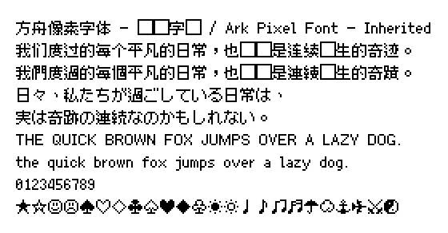
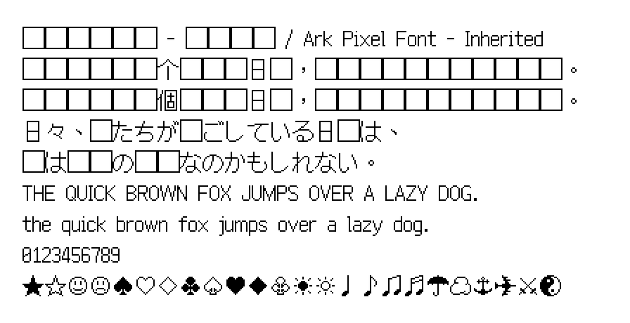

# 方舟像素字体 - 传承字形 / Ark Pixel Font - Inherited

[「方舟像素字体」](https://github.com/TakWolf/ark-pixel-font) 的传承字形版本。

与原项目的「传统印刷 zh_tr」不同，这个项目将完全遵循 [《傳承字形標準化文件》](https://github.com/ichitenfont/inheritedglyphs) 中的指导做法。

## 预览

可以通过 [Playground](https://ark-pixel-font-inherited.takwolf.com/playground.html) 实时预览字体效果。

### 10 像素

[示例文本](https://ark-pixel-font-inherited.takwolf.com/demo-10px.html) · [等宽模式-字母表](https://ark-pixel-font-inherited.takwolf.com/alphabet-10px-monospaced.html) · [比例模式-字母表](https://ark-pixel-font-inherited.takwolf.com/alphabet-10px-proportional.html)

### 12 像素

[示例文本](https://ark-pixel-font-inherited.takwolf.com/demo-12px.html) · [等宽模式-字母表](https://ark-pixel-font-inherited.takwolf.com/alphabet-12px-monospaced.html) · [比例模式-字母表](https://ark-pixel-font-inherited.takwolf.com/alphabet-12px-proportional.html)

### 16 像素

[示例文本](https://ark-pixel-font-inherited.takwolf.com/demo-16px.html) · [等宽模式-字母表](https://ark-pixel-font-inherited.takwolf.com/alphabet-16px-monospaced.html) · [比例模式-字母表](https://ark-pixel-font-inherited.takwolf.com/alphabet-16px-proportional.html)

## 字符统计

可以通过下面的链接来查看字体各尺寸目前支持的字符情况。

| 尺寸 | 等宽模式 | 比例模式 |
|---|---|---|
| 10px | [font-info-10px-monospaced](docs/font-info-10px-monospaced.md) | [font-info-10px-proportional](docs/font-info-10px-proportional.md) |
| 12px | [font-info-12px-monospaced](docs/font-info-12px-monospaced.md) | [font-info-12px-proportional](docs/font-info-12px-proportional.md) |
| 16px | [font-info-16px-monospaced](docs/font-info-16px-monospaced.md) | [font-info-16px-proportional](docs/font-info-16px-proportional.md) |

## 下载

可通过以下渠道下载最新的版本：

- [GitHub Releases](https://github.com/TakWolf/ark-pixel-font-inherited/releases)

目前提供 `.otf`、`.ttf`、`.woff2`、`.bdf`、`.pcf` 五种格式。

## 本地构建

这是一个标准的 [Python3](https://www.python.org) 项目。

当您配置好运行环境后，执行 `python ./build.py` 命令来开始构建。

等待任务完成后，可在 `build/outputs` 目录下找到生成的字体文件。

## 授权许可

分为「字体」和「构建程序」两个部分。

### 字体

使用 [「SIL 开放字体许可证第 1.1 版」](LICENSE-OFL) 授权，保留字体名称「Ark Pixel Inherited」。

### 构建程序

使用 [「MIT 许可证」](LICENSE-MIT) 授权。

## 官方社区

- [「像素字体工房」Discord 服务器](https://discord.gg/3GKtPKtjdU)
- [「像素字体工房」QQ 群 (302383204)](https://jq.qq.com/?_wv=1027&k=EXtKGHar)

## 程序依赖

- [Pixel Font Builder](https://github.com/TakWolf/pixel-font-builder)
- [Unidata Blocks](https://github.com/TakWolf/unidata-blocks)
- [Character Encoding Utils](https://github.com/TakWolf/character-encoding-utils)
- [PyYAML](https://github.com/yaml/pyyaml)
- [PyPNG](https://gitlab.com/drj11/pypng)
- [Pillow](https://github.com/python-pillow/Pillow)
- [Beautiful Soup](https://www.crummy.com/software/BeautifulSoup/)
- [Jinja](https://github.com/pallets/jinja)
- [GitPython](https://github.com/gitpython-developers/GitPython)
- [Requests](https://github.com/psf/requests)

## 赞助

如果这个项目对您有帮助，请考虑赞助来支持开发工作。

请通过下面的链接来查看收到的赞助的具体情况：

[赞助详情](https://github.com/TakWolf/TakWolf/blob/master/sponsors.md)
